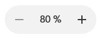
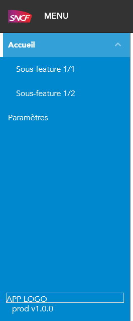
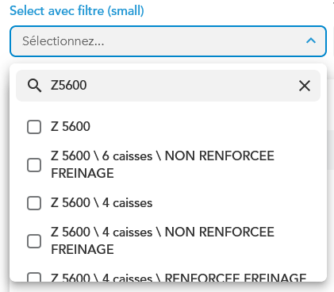
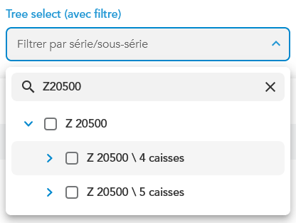
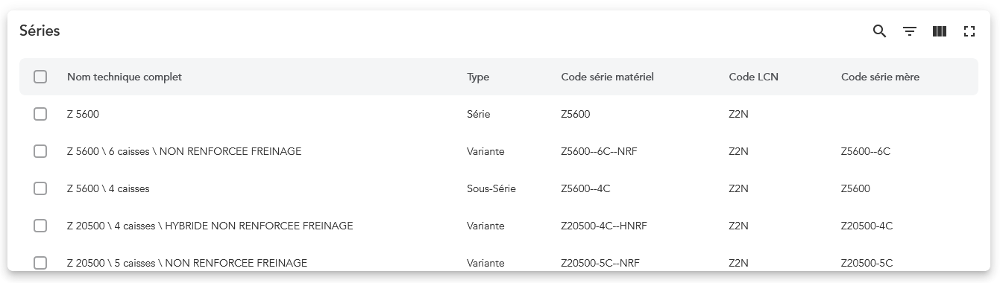

# mdl-angular

[](https://github.com/ThomasPrioul/mdl-angular-libs/releases/)
[](https://npmjs.com/package/mdl-angular)

Librairie de components Angular style SNCF / Maintenance Data Lab à utiliser dans votre projet Angular + Material.

## Points d'entrée

Vous y trouverez plusieurs points d'entrées :

### mdl-angular

Contient toutes les fonts, feuilles SCSS, pour styliser une application "Material" au design SNCF.

Des helpers, pipes et directives:

- directive **mdlStyleTag** : gère dynamiquement une balise `<style>` enfant de l'objet DOM ciblé.
- directive **TypeSafeMatCellDef** : classe qui permet de fortement typer les valeurs utilisées dans vos définitions de colonnes mat-table.
- helper **registerMaterialIcons** : pour enregistrer vos propres svg (inline ou fichier) pour utilisation avec `<mat-icon svgIcon="monIcone">`
- helper **ngClassToArray** : normalise la donnée d'entrée d'une ngClass en string[].
- pipe **mdlCast** : pour caster une donnée dans un ng-template (passer de **any** à un typage fort)

### mdl-angular/spinner

Un component spinner autonome **mdl-spinner**, et une directive **mdlLoading** pour ajouter un overlay loading centré à n'importe quoi.

### mdl-angular/zoom-button

Un bouton à trois zones pour gérer un niveau de zoom.



### mdl-angular/breadcrumbs

Un ensemble de boutons de navigation en fil d'Ariane à utiliser dans votre navbar.

### mdl-angular/fullscreen

Un service et une directive pour gérer l'API fullscreen sur n'importe quel élément du DOM.

### mdl-angular/side-menu-item

Un component menu-item récursif pour gérer des menus multi-niveaux sur un panneau à gauche de votre application (via un mat-drawer par exemple).



### mdl-angular/select-filter

Un component et une directive structurelle pour ajouter un filtre à un mat-select.
Il faut ajouter un pipe côté applicatif pour agir sur la valeur du filtre (en supprimant/masquant des mat-option).



### mdl-angular/tree-select

Directive, components et pipes pour transformer un mat-select en tree-select avec navigation au clavier, peut être cumulé au select-filter.



### mdl-angular/table2

Extension du mat-table pour gérer le mode frontend/backend pour la pagination, ajout d'une toolbar, bouton plein écran, gestion de la sélection des lignes, etc.



## Dépendances

Cette librairie a les dépendances suivantes :

- @angular ^16.2.0
- @angular/material ^16.2.0

Il n'y a pas de dépendance sur les librairies wcs-core et wcs-angular.

## Mise en place

### Installation du package

```bash
npm i mdl-angular
```

### Ajout des styles dans le fichier sass racine (styles.scss)

```scss
@use "mdl-angular/scss" as mdl;
/* ... Votre CSS utilisant des variables MDL */

/* Ajout des feuilles de styles MDL */
@import "mdl-angular/scss/fonts";
@import "mdl-angular/scss/material/core";
@import "mdl-angular/scss/colored-badge";
@import "mdl-angular/scss/highlight";
@import "mdl-angular/scss/panels";
```

### Ajouter les styles pour chaque composant Material utilisé

Vous pouvez choisir à la carte la "surcouche" SNCF sur votre composant Material.
Pour cela il faut importer le fichier scss du composant en question. Si vous n'utilisez pas les styles SNCF, il faudra quand même importer les styles angular : `@include mat.<component>-theme($my-material-theme)`;
Quand vous utilisez un style SNCF, pas besoin de préimporter le style material, la librairie s'en charge avec la bonne configuration.
A ce jour, tous les styles ne sont pas encore migrés en mode MDL, et il n'y pas d'import en une seule ligne.

```scss
@import "mdl-angular/scss/material/components/autocomplete";
@import "mdl-angular/scss/material/components/badge";
@import "mdl-angular/scss/material/components/button";
@import "mdl-angular/scss/material/components/card";
@import "mdl-angular/scss/material/components/chips";
@import "mdl-angular/scss/material/components/checkbox";
@import "mdl-angular/scss/material/components/dialog";
@import "mdl-angular/scss/material/components/table";
@import "mdl-angular/scss/material/components/datepicker";
@import "mdl-angular/scss/material/components/divider";
@import "mdl-angular/scss/material/components/input";
@import "mdl-angular/scss/material/components/menu";
@import "mdl-angular/scss/material/components/option";
@import "mdl-angular/scss/material/components/paginator";
@import "mdl-angular/scss/material/components/progress-bar";
@import "mdl-angular/scss/material/components/progress-spinner";
@import "mdl-angular/scss/material/components/radio";
@import "mdl-angular/scss/material/components/select";
@import "mdl-angular/scss/material/components/slide-toggle";
@import "mdl-angular/scss/material/components/slider";
@import "mdl-angular/scss/material/components/sidenav";
@import "mdl-angular/scss/material/components/sort";
@import "mdl-angular/scss/material/components/tabs";
@import "mdl-angular/scss/material/components/toolbar";
@import "mdl-angular/scss/material/components/tooltip";
@import "mdl-angular/scss/material/components/tree";
@import "mdl-angular/scss/material/components/snack-bar";
@import "mdl-angular/scss/material/components/form-field";
@import "mdl-angular/scss/material/components/stepper";
```

### Polices

Pour utiliser la police Avenir, veillez à bien importer le fichier "mdl-angular/scss/fonts" dans votre fichier de styles racine.

### Logo SNCF

La librairie embarque le logo SNCF en SVG, pour l'utiliser dans votre HTML, modifiez la balise assets dans angular.json:

```json
"assets": [
  // ... autres assets
  {
    "glob": "*.svg",
    "input": "projects/mdl-angular/assets/",
    "output": "/assets/"
  }
],
```

### Configuration typescript de Material

La nouvelle style guide SNCF utilise des form fields entourés, plutôt qu'avec un fond grisé et une bordure basse.
MDL gère les deux mais il vaut mieux [configurer material en mode outline](https://material.angular.io/components/form-field/overview#form-field-appearance-variants).

Créez ou modifiez un fichier contenant vos customizations Material:

```ts
{
  provide: MAT_FORM_FIELD_DEFAULT_OPTIONS,
  useValue: <MatFormFieldDefaultOptions>{
    appearance: "outline",
    color: "primary",
    subscriptSizing: "dynamic",
    floatLabel: "always",
  },
}
```

Importez ce provider dans votre bootstrap module ou votre app.component standalone avec bootstrapApplication(); Cela forcera les form fields en mode "outline".

### Light/dark mode

Le mode dark/light doit être spécifié explicitement au niveau d'un conteneur HTML, cela peut être un div spécifique ou le body du HTML, vous pouvez inverser le thème au niveau d'un sous-conteneur.

Pour le gérer au global dans l'application, veillez à bien utiliser la classe mat-app-background dans votre fichier index.html :

```html
<!DOCTYPE html>
<html lang="fr">
  <head>
    <meta charset="utf-8" />
    <base href="/" />
    <meta name="viewport" content="width=device-width, initial-scale=1" />
    <link rel="icon" type="image/x-icon" href="favicon.ico" />
  </head>
  <body class="mat-app-background light">
    <app-mrveille></app-mrveille>
  </body>
</html>
```

Ici la présence de la classe **light** force toute l'application en mode **light**.

Pour gérer dynamiquement cette classe sur l'élément body, on ne peut pas directement utiliser un binding, mais on peut utiliser une directive sur le bouton qui va permettre de changer le thème et utiliser la classe Renderer2:

```ts
// Créer un fichier dark-mode.directive.ts dans votre projet
import { coerceBooleanProperty } from "@angular/cdk/coercion";
import { Directive, Injectable, Input, Renderer2, inject } from "@angular/core";

@Directive({ selector: "[appDarkMode]", exportAs: "darkMode", standalone: true })
export class DarkModeDirective {
  private _enabled: boolean = false;
  private renderer = inject(Renderer2);

  constructor() {
    this.enabled = coerceBooleanProperty(localStorage.getItem("dark"));
  }

  public get enabled() {
    return this._enabled;
  }

  public set enabled(value: boolean) {
    this._enabled = value;
    localStorage.setItem("dark", `${this.enabled}`);

    this.renderer.addClass(document.body, value ? "dark" : "light");
    this.renderer.removeClass(document.body, value ? "light" : "dark");
  }
}
```

```html
<!-- Utilisation de la directive-->
<button appDarkMode #dark="darkMode" mat-menu-item (click)="dark.enabled = !dark.enabled">
  <mat-icon [innerText]="dark.enabled ? 'light_mode' : 'dark_mode'"></mat-icon>
  <span [innerText]="dark.enabled ? 'Mode clair' : 'Mode sombre'"></span>
</button>
```

## Démonstrateur

Ce repo contient une application exemple, pour la tester, cloner ce dépôt puis lancez :

```bash
npm i
npm start
```

Et allez sur http://localhost:4200.
